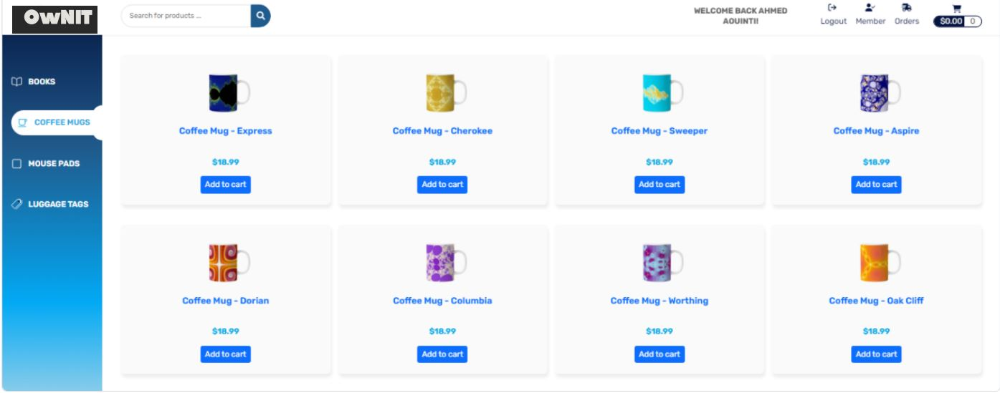

# OwN-IT

# Full Stack E-Commerce Website with Angular and Spring Boot
OwN-IT is an e-commerce platform designed to provide a seamless shopping experience. Built using modern Java and web development technologies, this application integrates robust backend features with a dynamic, user-friendly frontend.

## Technologies Used

- **Backend:** Java 11, Apache Maven, Hibernate, Spring Core, Spring Data, Spring REST, Spring Boot, Spring Security
- **Frontend:** HTML, CSS, Bootstrap, TypeScript, Angular
- **Authentication:** Okta

### Desktop view



### Mobile view


## Features

- User-friendly interface with easy navigation for product browsing
- Secure user authentication and authorization with Okta
- Dynamic product listings and shopping cart functionality
- Scalable backend using Spring Boot and Hibernate
- RESTful API design for seamless frontend-backend communication
- Role-based access control with Spring Security
- Responsive design with Bootstrap for compatibility across devices

## Setup Instructions

1. **Clone the Repository:**
   ```bash
   git clone <repository-url>


2.**Backend Setup: Configure your database settings in application.properties. Build the backend with:**
   mvn clean install

**Then run the backend:**
mvn spring-boot:run

3. **Frontend Setup:
Navigate to the Angular project directory:**
cd frontend

**Install dependencies:**
npm install

 **Run the Angular development server:**
    ng serve

**Configure Okta Authentication:**
   Update the Okta client settings as per your Okta app configuration.

**Contributing**
Contributions are welcome! Please fork the repository and create a pull request for any improvements or bug fixes.


